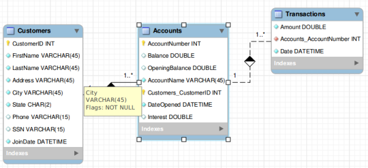

static website access
---------------------
* https://pravinc.github.io/www/JavaScript/Meenakshi_Finance/Recuring_Deposit/
* https://pravinc.github.io/www/JavaScript/Meenakshi_Finance/Savings_Interest/

pdf for statement generation
----------------------------
* https://stackoverflow.com/questions/60798327/generate-pdf-file-and-attach-to-e-mail
* https://www.google.com/search?q=android+create+pdf+and+mail
* https://www.google.com/search?q=django+bank+teller+app

free SQL DB
-----------
* try oracle free tier, if not use some free dev version and then find cheap paid
  * https://www.oracle.com/in/cloud/free/#always-free
  * https://docs.oracle.com/en/cloud/paas/atp-cloud/index.html
  * https://docs.oracle.com/en/cloud/paas/autonomous-database/adbsa/autonomous-always-free.html
  * [Getting Started with Oracle Autonomous Transaction Processing for Developers](https://www.youtube.com/watch?v=ZOLVsK_lXa4)
  * https://docs.oracle.com/en-us/iaas/Content/Billing/Concepts/budgetsoverview.htm
* how about MongoDB with TRANSACTIONs in the ACCOUNT entry itself?
* google 'hosting webapp in cloud free'
* https://egliww11.wordpress.com/source-code-and-database-schema/

  

* https://hasura.io/blog/top-postgresql-database-free-tier-solutions/
  * ElephantSQL only 20MB
    * https://www.elephantsql.com/plans.html
  * Neon only free preview
    * https://neon.tech/docs/introduction/technical-preview-free-tier/
* YugabyteDB - no backup so possibility of loss of data
* https://www.lastweekinaws.com/blog/10-free-cloud-databases-you-should-consider-and-1-you-shouldnt/
* https://aws.amazon.com/getting-started/hands-on/control-your-costs-free-tier-budgets/
* https://cloud.google.com/free/docs/free-cloud-features#app-engine

webapp hosting
--------------
* https://dashbird.io/blog/how-to-deploy-nodejs-application-aws-lambda/
* google 'aws lambda timer trigger' and checkout tutorial videos
  * https://docs.aws.amazon.com/AmazonCloudWatch/latest/events/RunLambdaSchedule.html
  * https://aws.amazon.com/cloudwatch/pricing/
